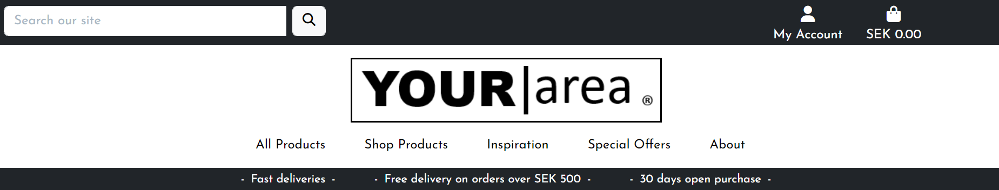
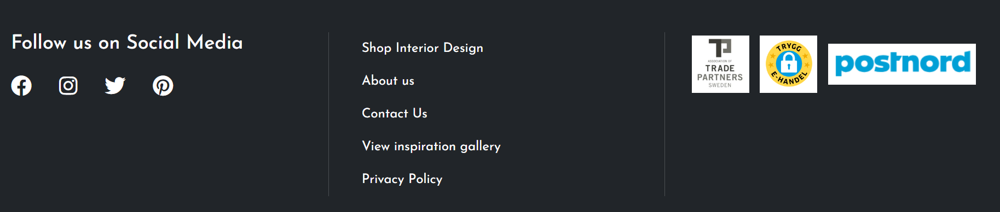

# SKI RESORTS

Ski Resorts website is an online portal with information about ski resorts all over the world. Ski resort locates information about the resort and then presents the information in an easy and comprehensible way. It's a quick and easy way to find the next and best ski adventure!

**Ski resorts locator made it easier for everyone**

The webiste is targeted towards users that want to see what diffrent ski resorts is out there, compare them and find the resort best suited for their needs. Maybe they just want to check the opening season and hours for a resort or simply want to know if a resort offers accommodation or not. For those that are considering a visit to a resort but want to see what others thought of the resort through their experience, can find user ratings and comments attached to each resort. Users with disabilities or smaller children can find available lifting arrangements for each resort.


## UX

A visitor to Ski Resorts Locator would be someone who is most likely an adult who enjoys ski- and outdoor adventure and is curious to find the next ski resort to visit.

## User Stories

### EPIC | Admin page

- As a site administrator I can view my ski resorts so that I can manage all resorts I made in one place.
- As a site admin I can edit and delete comments/star ratings I made so that I can manage any typos or misstakes.
- As a site administrator I can create/read/update and delete ski resorts so that I can manage the app content.
- As a admin I can edit and delete resorts that I created so that I can make changes without having to start over.
- As a admin I can input details so that I can market and share our resort with others.

### EPIC | Rating and commenting

- As a site user I can give ski resorts star rating so that other users can make a better assessment.
- As a site user I can see the ski resorts with the best user rating on the site's main page so that I can get inspired at once.
- As a site admin I can approve comments so that no objectionable comments is shown.
- As a site user I can comment on ski resorts so that I can share my experience with others.

### EPIC | Site Navigation

- As a site user I can intuitively navigate around the site so that I can easily find content.
- As a site user I can immediately understand the purpose of the site so that I can decide if it meets my needs.
- As a site user I can click on a ski resort I am interested in so that I can get all the details for that resort.
- As a site user I can see a list with all ski resorts so that I can choose a resort to visit.

### EPIC | User Account

- As a site user I can see my log in status so that I can visually see if im logged in or out.
- As a site user I can register an account so that I can add/edit/delete comments I made.
- As a site user I can log in and out of my account so that I can keep my account secure.

### User Stories not yet implemented
The following user stories were scoped out of the project due to time constraints and labelled as "Won't Have" and "Could Have" on the project board on Github. It is intended that these user stories will be implemented at a later date.

- As a ski user I can find suggestions of activities in the area so that I can vary my stay.
- As a site user I can find links to local ski rentals so that I can find the equipment I need.
- As a site user I can find links to car rentals so that I can find a rental car as close to the ski resort as possible.
- As a site user I can find suggestions for accommodations so that I can rely on finding the nearest.
- As a site user I can view all my bookmarked ski resorts so that I can find them all in one place.
- As a site user I can filter ski resorts so that I can find resorts in my area.
- As a site user I can bookmark a ski resort so that I can find the resort easier at a later time.

## Agile Methodology

Github projects was used to manage the development process using an agile approach. Please see link to project board [here](https://github.com/users/TheresLundqvist/projects/1)

The 5 Epics listed above were documented within the Github project as Labels. A Github Issue was created for each User Story which was then allocated to a label(Epic). Each User Story has defined acceptance criteria to make it clear when the User Story has been completed. The acceptance criteria are further broken down into tasks to facilitate the User Story's execution. The user stories were also added and worked on in project iterations with a set deadline through Github milestones, this project was conducted through a total of 4 iterations. The user stories not yet to be finnished were added to a project backlog(milestone).
  
## Design

The site has a very simple and clean design with a wintry color theme and good contrast.

### Colour Scheme

I used [coolors.co](https://coolors.co/e84610-112b3c-ffffff-5d646b) to generate my colour palette.

  

The colour scheme of the site is mainly golden gate bridge-orange, dark blue and White. The colours chosen are wintry white and blue and with orange to give good contrast.

Great care was taken to establish a good contrast between background colours and text at all times to ensure maximum user accessibility.

- **#E84610** used for primary highlights, icons and buttons.
- **#112B3C** used for brand, headings and hoover effects on buttons.
- **#FFFFF** used for backgrounds
- **#5D646B** used for footer text.

### Fonts

Josefin Sans is the main font used for the body of the website with the only exeption of using Tilt Neon for the sub heading in the main image caraousel. These fonts were imported via Google Fonts. Sans Serif is the backup font, in case for any reason the main font isn't being imported into the site correctly.

- [Josefin Sans](https://fonts.google.com/specimen/Josefin+Sans?query=josefin+sans) was used for the body content.

- [Tilt Neon](https://fonts.google.com/specimen/Tilt+Neon?query=tilt+neon) was used for sub heading in main image caraousel.

### Icons

Icons from Font Awesome is used throughout the site, such as brand icon, search bar magnifying glass, star rating, social media icons and icons for heading in resort details.


- [Font Awesome](https://fontawesome.com) icons were used throughout the site, such as the social media icons in the footer.

### Imagery

A total of five static images is used for the website. Three static images is used for the main image caraousel. One is used as a placeholder image for the resorts if the user chooses not to upload a image/images for a resort. The last static image uploaded to the app is used for the about page. The rest of the imagery will be uploaded and stored in Cloudinary by admin when creating the individual resorts.  

## Wireframes

I've used [Miro](https://miro.com/app/dashboard/) to design my sites wireframes.

### Home Page Wireframes

<details>
<summary>Home Page</summary>  
<strong>Desktop View</strong>  

  
  
<strong>Mobile</strong>  
  
</details>  

<details>
<summary>Resort Details page</summary>  
<strong>Desktop View</strong>  

  
  
<strong>Mobile</strong>  
  
</details>  
<details>
<summary>About page</summary>  
<strong>Desktop View</strong>  

  
  
<strong>Mobile</strong>  
  
</details>  
<details>
<summary>Contact page</summary>  
<strong>Desktop View</strong>  

  
  
<strong>Mobile</strong>  
  
</details>  
<details>
<summary>Account pages</summary>  
<strong>Desktop View</strong>  

  
  
  
  
<strong>Mobile</strong>  
  
  
  
</details>  


## Features

### Header

  

**Logo**  
A customised logo was created using Josefin Sans font in italic style with two arrow icon from Font Awesome. This logo is positioned in the top left of the navigation bar. The logo is linked to the home page for ease of navigation for the user.  
  
**Navigation**  
The navigation bar is present at the top of every page and includes all links to the various other pages. The More navigation link is a drop down menu which includes a view all link and the Contact and About pages. When the user has logged in, the login link changes to display log out instead, giving the user their logged in status.

### Footer

  

The footer section includes links to Facebook, Instagram, Twitter and Youtube. Clicking the links in the footer opens a separate browser tab to avoid pulling the user away from the site.
  
### Home Page  
  
**Main Image Carousel**  
  
  
  
The home page includes a bootstrap image carousel that alternates thorugh three images with diffrent encouraging and telling texts about the ski resorts website and then a view all button which links to the resort cards to view all the resorts on the website.  

- Find the Ski Resort best suited for you - All resort listed in one place  
- Get inspired >> Go Skiing - See all the amenities for the resort
- Secure a great ski experience - Read customer experience and leave yours

**Resort cards**

  
  
The resort cards gives the user a glimpse over the diffrent resorts on the webiste. The user can preview the resort through a image, see a preview of the resort description and a read more button that takes the user to the full detailed resort page. The resort cards are intented to give the user the possibility to overview the diffrent resorts in a clean and organized way, get inspired and then let them decide which resort they want a more detailed view over. The resort rating counter is visable on the cards and in the full view, so that the user instantly can see which resort has the best rating. 

### Resort details page 
  
**Resort description**  
  
  
  
After the resort image a detailed description of the resort follows. It is a descriptive text that sums up the listed features of the resort. This textfield creates a more painted picture for the user. Underneath the description a bootstrap image carousel shuffles three images of the resort to give the user some inspiration and overview of the resort.
  
**Resort listed features**  
  
  
  
This list is an overview of the resort amenities. The user can find useful information before their planned visit such as opening hours and prices. If a user is in need of a particular lift, they can find all lifting arrangements available for the resort in this listed view. This view is intended as a quick and clean way for the user to get an fast overview of the resort and what they offer.

**Rating and comments counter**  
  
  
  
The counters for rating and comments give the user a fast assessment of the resort. They can see how many likes and comments the resort has gotten from other users. Users can use the share icon to share the page and resort with others.  
  
**Comments**  
  
  
  
All users can view all comments made by others, but only logged-in users can leave a comment. The comments are only visable after and if admin approves. The user receives a message notifying them that the comment is awaiting approval before being published.

**Rating** 

  

Users can see the average rating for each resort in the preview cards but also in the full detailed view. Logged in users can leave rating along with a comment to better help others make a descision on which resort to visit next.


**Edit and delete comments**  

  
  
  
  
  
  
All logged in users can edit and delete their own comments. The edit and delete links are only visable on the comments made my the logged in user. When user clicks on the edit link they will be redirected to a new edit page, the comment will disappear from the website after the edit until Admin approves of the edited comment.  


### About page  
  
  
  
The about page gives the user a short background story about the website to the user. 

### Contact page  
  
  
  
The contact page gives the user the opportunity to contact the website with questions or other subjects surrounding the website.  

### Account pages  

Django allauth was installed and used to create the Sign up, Log in and Log out functionality. Success messages inform the user if they have logged in/ logged out successfully.

**Register**  

  

**Sign in**  
  
  

**Sign out**  
  
 

## Future Features

The following user stories were scoped out of the project due to time constraints and labelled as "Won't have" and "Could Have" on the project board in Github. It is intended that these user stories will be implemented at a later date.  

- As a ski user I can find suggestions of activities in the area so that I can vary my stay.
- As a site user I can find links to local ski rentals so that I can find the equipment I need.
- As a site user I can find links to car rentals so that I can find a rental car as close to the ski resort as possible.
- As a site user I can find suggestions for accommodations so that I can rely on finding the nearest.
- As a site user I can view all my bookmarked ski resorts so that I can find them all in one place.
- As a site user I can filter ski resorts so that I can find resorts in my area.
- As a site user I can bookmark a ski resort so that I can find the resort easier at a later time.


## Tools & Technologies Used

- [HTML](https://en.wikipedia.org/wiki/HTML) used for the main site content.
- [CSS](https://en.wikipedia.org/wiki/CSS) used for the main site design and layout.
- [JavaScript](https://www.javascript.com) used for user interaction on the site.
- [Python](https://www.python.org) used as the back-end programming language.
- [Git](https://git-scm.com) used for version control. (`git add`, `git commit`, `git push`)
- [GitHub](https://github.com) used for secure online code storage.
- [GitHub Pages](https://pages.github.com) used for hosting the deployed front-end site.
- [Gitpod](https://gitpod.io) used as a cloud-based IDE for development.
- [Bootstrap](https://getbootstrap.com) used as the front-end CSS framework for modern responsiveness and pre-built components.
- [Django](https://www.djangoproject.com) used as the Python framework for the site.
- [PostgreSQL](https://www.postgresql.org) used as the relational database management.
- [ElephantSQL](https://www.elephantsql.com) used as the Postgres database.
- [Heroku](https://www.heroku.com) used for hosting the deployed back-end site.
- [Cloudinary](https://cloudinary.com) used for online static file storage.
- [Miro](https://miro.com/app/dashboard) used to generate wireframe images.
- [Chrome Dev Tools](https://developer.chrome.com/docs/devtools/) used for overall development and tweaking, including testing responsiveness and performance.
- [Font Awesome](https://fontawesome.com/) used for icons throughout the site.
- [Google Fonts](https://fonts.google.com/) used to import and alter fonts on the page.
- [W3C](https://validator.w3.org/#validate_by_input) used for HTML & CSS Validation.
- [Coolors](https://coolors.co/) used to create colour palette.
- [Favicon](https://favicon.io/) Used to create the favicon.
- [Grammerly](https://app.grammarly.com/) used to proof read the README.md.
- [Crispy Forms](https://django-crispy-forms.readthedocs.io/en/latest/) used to manage Django Forms.
- [Cloudinary](https://cloudinary.com/) used for uploading the images and hosting them.
- [Bootstrap](https://getbootstrap.com/) CSS Framework for developing responsiveness and styling.
- [SmartDraw](https://www.smartdraw.com/) used to create the database schema design.


## Database Design

I used principles of Object-Oriented Programming throughout this project and Django’s Class-Based Generic Views. Django AllAuth was used for the user authentication system.
In order to create resort to the webiste a custom resort model was required. The Comment model allows users to comment on resorts and the resort is a foreign key in the comment model given a comment can only be linked to one resort. The contact model is non-relational model as it is only for the users to be able to communicate with the website's owner/admin. The rating model allows logged in users to leave a rating and therefore the resort and user fields are foreign keys given that user must be logged in and the rating can only be linked to one resort.

The diagram below details the database schema.

 

## Testing

For all testing, please refer to the [TESTING.md](TESTING.md) file.

## Deployment

The live deployed application can be found deployed on [Heroku](https://ski-resorts-locator.herokuapp.com).

### ElephantSQL Database

This project uses [ElephantSQL](https://www.elephantsql.com) for the PostgreSQL Database.

To obtain your own Postgres Database, sign-up with your GitHub account, then follow these steps:
- Click **Create New Instance** to start a new database.
- Provide a name (this is commonly the name of the project: Ski-resorts).
- Select the **Tiny Turtle (Free)** plan.
- You can leave the **Tags** blank.
- Select the **Region** and **Data Center** closest to you.
- Once created, click on the new database name, where you can view the database URL and Password.

### Cloudinary API

This project uses the [Cloudinary API](https://cloudinary.com) to store media assets online, due to the fact that Heroku doesn't persist this type of data.

To obtain your own Cloudinary API key, create an account and log in.
- For *Primary interest*, you can choose *Programmable Media for image and video API*.
- Optional: *edit your assigned cloud name to something more memorable*.
- On your Cloudinary Dashboard, you can copy your **API Environment Variable**.
- Be sure to remove the `CLOUDINARY_URL=` as part of the API **value**; this is the **key**.

### Heroku Deployment

This project uses [Heroku](https://www.heroku.com), a platform as a service (PaaS) that enables developers to build, run, and operate applications entirely in the cloud.

Deployment steps are as follows, after account setup:

- Select **New** in the top-right corner of your Heroku Dashboard, and select **Create new app** from the dropdown menu.
- Your app name must be unique, and then choose a region closest to you (EU or USA), and finally, select **Create App**.
- From the new app **Settings**, click **Reveal Config Vars**, and set your environment variables.

| Key | Value |
| --- | --- |
| `CLOUDINARY_URL` | user's own value |
| `DATABASE_URL` | user's own value |
| `DISABLE_COLLECTSTATIC` | 1 (*this is temporary, and can be removed for the final deployment*) |
| `SECRET_KEY` | user's own value |

Heroku needs two additional files in order to deploy properly.
- requirements.txt
- Procfile

You can install this project's **requirements** (where applicable) using:
- `pip3 install -r requirements.txt`

If you have your own packages that have been installed, then the requirements file needs updated using:
- `pip3 freeze --local > requirements.txt`

The **Procfile** can be created with the following command:
- `echo web: gunicorn app_name.wsgi > Procfile`
- *replace **app_name** with the name of your primary Django app name; the folder where settings.py is located*

For Heroku deployment, follow these steps to connect your own GitHub repository to the newly created app:

Either:
- Select **Automatic Deployment** from the Heroku app.

Or:
- In the Terminal/CLI, connect to Heroku using this command: `heroku login -i`
- Set the remote for Heroku: `heroku git:remote -a app_name` (replace *app_name* with your app name)
- After performing the standard Git `add`, `commit`, and `push` to GitHub, you can now type:
	- `git push heroku main`

The project should now be connected and deployed to Heroku!

### Local Deployment

This project can be cloned or forked in order to make a local copy on your own system.

For either method, you will need to install any applicable packages found within the *requirements.txt* file.
- `pip3 install -r requirements.txt`.

You will need to create a new file called `env.py` at the root-level,
and include the same environment variables listed above from the Heroku deployment steps.

Sample `env.py` file:

```python
import os

os.environ.setdefault("CLOUDINARY_URL", "user's own value")
os.environ.setdefault("DATABASE_URL", "user's own value")
os.environ.setdefault("SECRET_KEY", "user's own value")

# local environment only (do not include these in production/deployment!)
os.environ.setdefault("DEBUG", "True")
```

Once the project is cloned or forked, in order to run it locally, you'll need to follow these steps:
- Start the Django app: `python3 manage.py runserver`
- Stop the app once it's loaded: `CTRL+C` or `⌘+C` (Mac)
- Make any necessary migrations: `python3 manage.py makemigrations`
- Migrate the data to the database: `python3 manage.py migrate`
- Create a superuser: `python3 manage.py createsuperuser`
- Load fixtures (if applicable): `python3 manage.py loaddata file-name.json` (repeat for each file)
- Everything should be ready now, so run the Django app again: `python3 manage.py runserver`

#### Cloning

You can clone the repository by following these steps:

1. Go to the [GitHub repository](https://github.com/TheresLundqvist/Ski-resorts) 
2. Locate the Code button above the list of files and click it 
3. Select if you prefer to clone using HTTPS, SSH, or GitHub CLI and click the copy button to copy the URL to your clipboard
4. Open Git Bash or Terminal
5. Change the current working directory to the one where you want the cloned directory
6. In your IDE Terminal, type the following command to clone my repository:
	- `git clone https://github.com/TheresLundqvist/Ski-resorts.git`
7. Press Enter to create your local clone.

Alternatively, if using Gitpod, you can click below to create your own workspace using this repository.

[](https://gitpod.io/#https://github.com/TheresLundqvist/Ski-resorts)

Please note that in order to directly open the project in Gitpod, you need to have the browser extension installed.
A tutorial on how to do that can be found [here](https://www.gitpod.io/docs/configure/user-settings/browser-extension).

#### Forking

By forking the GitHub Repository, we make a copy of the original repository on our GitHub account to view and/or make changes without affecting the original owner's repository.
You can fork this repository by using the following steps:

1. Log in to GitHub and locate the [GitHub Repository](https://github.com/TheresLundqvist/Ski-resorts)
2. At the top of the Repository (not top of page) just above the "Settings" Button on the menu, locate the "Fork" Button.
3. Once clicked, you should now have a copy of the original repository in your own GitHub account!

### Local VS Deployment

Use this space to discuss any differences between the local version you've developed, and the live deployment site on Heroku.


## Credits

### Content

| Source | Location | Notes |
| --- | --- | --- |
| [Markdown Builder](https://traveltimn.github.io/markdown-builder) | README and TESTING | tool to help generate the Markdown files |
| [W3Schools](https://www.w3schools.com/howto/howto_js_topnav_responsive.asp) | entire site | responsive HTML/CSS/JS navbar |
| [W3Schools](https://www.w3schools.com/howto/howto_css_modals.asp) | contact page | interactive pop-up (modal) |
| [StackOverflow](https://stackoverflow.com/a/2450976) | quiz page | Fisher-Yates/Knuth shuffle in JS |
| [WhiteNoise](http://whitenoise.evans.io) | entire site | hosting static files on Heroku temporarily |
| [Django Docs](https://docs.djangoproject.com/en/4.2/)
| [Bootstrap Docs](https://getbootstrap.com/docs/5.3/getting-started/introduction/)
| [Code Institute Blog Walkthrough Project](https://github.com/Code-Institute-Solutions/Django3blog)


### Media

| Source | Location | Type | Notes |
| --- | --- | --- | --- |
| [Pexels](https://www.pexels.com) | entire site | image | All imagery on the site was sourced from Pexels.com |
| [Favicon](https://favicon.io/) | entire site | image | Favicon for website |
| [Font Awesome](https://fontawesome.com/) | entire site | image | All icons for the site |  
  
### Acknowledgements

- I would like to thank my Code Institute mentor, [Tim Nelson](https://github.com/TravelTimN) for their support throughout the development of this project.
- I would like to thank the [Code Institute](https://codeinstitute.net) tutor team for their assistance with troubleshooting and debugging some project issues.
