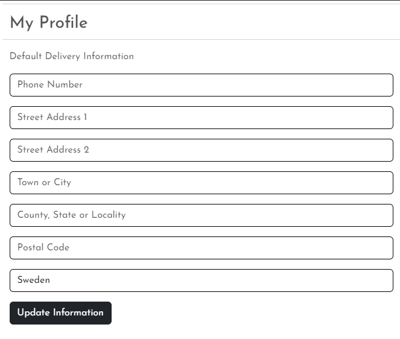

# YOUR AREA

Your Area is a home décor B2C e-commerce store. The site is targeted towards users who are interested in luxurious interior products.
Users can browse and purchase a range of home decor and interior design products.

The payment system uses Stripe.  
**Please note that this website is for educational purposes, <u>do not</u> enter any personal credit/debit card details when using this site**.
To test this system, test card details can be used. A list of these can be found in Stripe's documentation [here](https://stripe.com/docs/testing).  

The live link to the website can be found here - [Your Area](https://your-area.herokuapp.com/)


## Agile Methodology
Github projects was used to manage the development process using an agile approach. Please see link to project board [here](https://github.com/users/TheresLundqvist/projects/3)


The 5 Epics listed below were documented within the Github project as Milestones. A Github Issue was created for each User Story which was then allocated to a label(Epic). Each User Story has defined acceptance criteria to make it clear when the User Story has been completed. The acceptance criteria are further broken down into tasks to facilitate the User Story's execution.

### MoSCoW Prioritization

I've decomposed my Epics into stories prior to prioritizing and implementing them.
Using this approach, I was able to apply the MoSCow prioritization and labels to my user stories within the Issues tab.

- **Must Have**: guaranteed to be delivered (*max 60% of stories*)
- **Should Have**: adds significant value, but not vital (*the rest ~20% of stories*)
- **Could Have**: has small impact if left out (*20% of stories*)
- **Won't Have**: not a priority for this iteration

### User Stories

#### EPIC | Site Navigation
- As a Site user I can immediately understand the purpose of the site so that I can decide if it meets my needs.
- As a Site user I can sort all products so that I can view products based on price or title.
- As a Site user I can search all products so that I can find what I am looking for.
- As a Site user I can click on a product so that I can read the full product details.
- As a Site user I can view a list of products so that I can select a product to view.
- As a Site user I can intuitively navigate around the site so that find content.

#### EPIC | User Account
- As a Site user I can recover my password in case I forget it so that I can regain access to my account.
- As a Site user I can save my personal details in my user profile so that I do not have to fill them out for future orders.
- As a Site user I can view my order history so that I can remember what purchases I've made
- As a Site user I can see my login status so that I know if I'm logged in or out.
- As a Site user I can register a account so that I can have a personal account.
- As a Site User I can log in and out of my account so that I can keep my account secure.

#### EPIC | Purchasing
- As a Site user I can view and recieve a order confirmation after checkout so that I know my purchase was successful.
- As a Site user I can checkout as a guest so that I don't have to sign up for an account.
- As a Site user I can view a the contents of my shopping cart at any time so that I can see what is included and the total cost.
- As a Site user I can easily enter my payment information securely so that I can purchase my chosen products quickly with no issues.
- As a Site user I can adjust the quantity of individual products in my cart so that I can easily make changes before I purchase.
- As a Site user I can see a summary of my shopping cart when I checkout so that I know what products are included and the total cost before I commit to purchasing.
- As a Site user, I can view a running total of my shopping cart as I am shopping so that I can see how much it costs in total.
- As a Site user I can add several products in different quantities to my shopping cart so that I can purchase them all together when I am ready.
- As a Site user I can save my personal details in my user profile so that I don't have to fill them out for future orders.
- As a Site user I can view my order history so that I can keep track of my orders.
- As a Site user I can view a specific category of products so that I can browse the type of products I'm looking for.


#### EPIC | Admin
- As a store owner I can add/edit/delete products through an easy-to-use interface so that I can manage the store's contents.

#### EPIC | User Interaction
- As a Site user I can sign up for the website's newsletter so that I can keep up to date with new products and promotions.

#### User stories not yet implemented

The following user stories were scoped out of the project due to time constraints and labelled as "Won't Have" or "Could have" on the project board on Github. It is intended that these user stories will be implemented at a later date. These User Stories are included in Your Area's backlog.

- As a Site owner I can approve comments so that no objectionable comments is shown.
- As a Site user I can add products to my saved items so that I can go back and view them at a later date.
- As a Site user I can give products star ratings and comments so that other users can make a better assessment.

## UX

A visitor to Your Area would be someone who is most likely an adult who is interested in buying design interior products.  

## Design 

### Colour Scheme

The colour scheme of the site is mainly white and dark grey. The colours chosen are neutral in order to showcase the Home Décor Products with minimal distraction. 

Great care was taken to establish a good contrast between background colours and text at all times to ensure maximum user accessibility.

I used [coolors.co](https://coolors.co/343a40-ffffff-f8f9fa-564592) to generate my colour palette.


### Imagery

There is 13 static images on the site where 8 of them is located in the inspiration gallery. Three static images is located in the footer for the companies representated there. The rest is the custom logo image and the main image in the home page. The static images were downloaded from the pexels image library.

### Typography  

The Josefin Sans font is the main font used for the body of the website. This font was imported via Google Fonts. Sans Serif is the backup font, in case for any reason the main font isn't being imported into the site correctly.

- [Josefin Sans](https://fonts.google.com/specimen/Montserrat) was used for the main content.

- [Playfair Display](https://fonts.google.com/specimen/Lato) was used for the overlay of the main image on the home page.

- [Font Awesome](https://fontawesome.com) icons were used throughout the site, such as the social media icons in the footer.

## Wireframes

<details>

 <summary>Home Page</summary>


</details>

<details>

 <summary>Products Page</summary>


</details>

<details>

 <summary>Contact Page</summary>


</details>

<details>

 <summary>About Page</summary>


</details>

<details>

 <summary>Gallery Page</summary>


</details>

<details>

 <summary>Bag Page</summary>


</details>

<details>

 <summary>Checkout Page</summary>


</details>

<details>

 <summary>Order Confirmation</summary>


</details>

<details>

 <summary>Profile</summary>


</details>

<details>

 <summary>Product Management</summary>


</details>

## Features

### Header


**Logo**
- A customised logo was created using Microsoft Word and then adding a border using CSS styling.
- This logo is positioned in the center underneath the first navigation bar. The logo is linked to the home page for ease of navigation for the user.

**Navigation Bar**

- The navigation bar is visible at the top of every page and includes links to the other pages.

**Search Bar**


- The search bar displays in the top navbar.
- On smaller screens, this bar becomes a search icon which when clicked will drop down the full bar.
- Any searched word will match itself to any text in the product's title, or description and display the results on the product's page.

**User Icon**

- The User icon navigation link is a drop down menu which includes the Sign up and Log in links. 
- The options to Sign up or Log in will change to the option to log out once a user has logged in.
- Once a user has signed in, the 'My Profile' option becomes available in the User dropdown.


- If the superuser has signed in, one more option appears such as 'Product Management'.
**Bag Icon**


- Located on the right side of the navbar next to the User icon is the bag Icon.
- Once a product is added to the bag, a number displaying in blue of the total quantity of items appears, located at the bottom of the bag icon.
- As the user adds products to their bag, a toast message appears in the top right-hand corner of the screen informing the user that the item has been added, giving them a snapshot of the bag contents and the total cost of the bag.


- Clicking the "Go to secure checkout" button navigates the user to the shopping bag page which displays a summary of what's been added.

### Footer


- The footer appears at the bottom of every page.
- The footer section includes links to Facebook, Instagram, Twitter and Pinterest.
- The Quick Links section has links to the main parts of the site including 'Contact Us' and 'Privacy Policy'.
- On the right hand side of the footer there are links to websites including Tradepartner Sweden, Secure e-commerce trade in Sweden, and the swedish mailservice Postnord. These links were included to increase the search rating of the website.
- Clicking all external links will open up the respective website in another tab to avoid pulling the user away from the site.

### Home Page

**Call to Action Section**


- The home page includes a call to action section which encourages the user to 'shop now' with the message "Buy Home Décor and Interior Designs online" and an image of a stylish yellow pop of color armchair. 

**About Section**


- The about section gives a brief overview of what the site has to offer and includes relevant keywords in `<strong></strong>` tags to improve the site's search ranking.

### User Account Pages

**Sign Up**


**Sign In**


**Log Out**


- Django allauth was installed and used to create the Sign up, Log in and Log out functionality. 
- Success messages inform the user if they have logged in/ logged out successfully.
- When a user signs up for an account they must verify their email address by clicking on the authentication link emailed  to the address they provided.
- If a user forgets their password they can reset it by clicking the 'Forgot Password' on the log in page.

### Profile
**Delivery Details**


- The delivery information section stores the user's delivery address and phone number.
- The information provided here is used to autofill the delivery address when placing an order.

**Order History**


- The order history section displays a list of every order the user has placed.
- The table displays the order number, date it was ordered and the order total.
- Clicking the order number will take the user to a summary page of that order.

### Products


- When clicking the 'All products' link in the navbar the dropdown menu will show all the different filters which includes 'By Price', 'By Rating', 'By Category' and 'All Products'. 


- The 'Shop Products' link will display a list of all products sorted after category.
- Clicking any of the categories will filter the products to only show products from the category selected.
- The category selected will display as the page heading.


- Each product card shows an image of the product, its title, rating, category badge and price.
- If the user is a superuser, edit and delete buttons will appear at the bottom of the product card.
- The products page is fully responsive, adjusting how many products are on each row depending on the user's screen size.
- A sort box is located on the products page where users can sort all products by price, name (A-Z), rating and category(A-Z) in ascending or descending order.


### Product Detail


- When the user clicks on an individual product card they are taken to the full product details.
- The product detail page displays the product image, title, category badge, rating, price, product details and estimated dispatch time.
- If the user is a superuser, edit and delete buttons will appear below these details.

**Quantity Buttons**
- The quantity buttons are located underneath the product details and are used to add items to the bag.
- The plus and minus buttons increase and decrease the input value.
- If the value is set to 1 the minus quantity will be disabled. Respectively if the value is set to 99 the plus button is disabled.
- If the user manually types in a negative number or a number >99 and clicks "Add to Bag" an error button will appear informing the user of the parameters needed to be successful.
- Clicking the 'Add to Bag' button takes the number in the input field and adds that amount of products to the bag.
- Clicking the 'Keep Shopping' button takes the user back to the store.

### Product Management
**Add Product**


- The add product page can be accessed by clicking the 'Product Management' button in the user dropdown menu, under the user icon. These options are only visible to superusers.
- If a user tries to add a product (by changing the url) without being a superuser they are redirected to the sign in page.
- If the form is submitted without a required field blank or with just whitespace then an error message will appear above that particular field, notifying the user of the issue.
- The user can upload a photo if they wish. If they choose not to, a default image displays as their product image.
- Clicking the 'Add Product' button at the bottom of the form will create the product providing there are no errors on the form.
-  The user will receive a success message notifying them that the product has been successfully added.

**Edit Product**


- The superuser can choose to edit a Product by clicking the edit button on the product card or on the product detail page. 
- The form opens with all fields populated with the original content.
- The image field displays a thumbnail of the existing image and has a checkbox option to remove it. Checking this will change the image to the default image.
- If a user tries to add a product (by changing the url) without being a superuser they are redirected to the sign in page.
- The superuser will receive a success message notifying them that the product has been successfully updated.

**Delete Product**


- The superuser can choose to delete a Product by clicking the delete button on the product card or on the product detail page. 
- The superuser is asked to confirm if they wish to delete the product or cancel.
- The superuser will receive a success message notifying them that the product has been successfully deleted.

### Bag


- When the user clicks on the shopping bag icon in the nav bar they are taken to the shopping bag page which shows the products which the user has added to their cart, unit price, quantity and subtotal.

**Quantity Buttons**
- The quantity input box displays the product quantity the user has added to their bag.
- The plus and minus buttons increase and decrease the input value.
- If the value is set to 1 the minus quantity will be disabled. Respectively if the value is set to 99 the plus button is disabled.

**Update and Remove Buttons**


- Clicking the 'update' link saves any changes to the quantity and updates the item's subtotal.
- Clicking the 'Remove' link removes the item completely from the user's bag.
- If the user manually types in a negative number and clicks 'update', the item will be removed from the item from the bag.
- If the user manually types in a number >99 and clicks 'update' an error message will display informing the user of the correct parameters.

**Total Section**
- At the end of the line items is a summary of the costs.
- The summary features the bags total, delivery cost and the grand total to pay.
- Underneath the grand total users will find a message informing them of how much more they need to spend to receive free delivery if they haven't already met the free delivery threshold (SEK 500). 
- Beneath the grand total is two buttons. From here the user can either continue to the checkout or return to the products page by clicking 'Keep Shopping'.

### Checkout 


**Details**
- Within the details section the user can fill out their contact details, delivery address, and card number.
- If the user is a guest, a link to create an account or login will be present.
- If the user is signed in a checkbox to save the delivery information can be checked.
- If the user is signed in and has delivery information saved, the delivery details and email address will be automatically filled in.
- If a user leaves a required field empty, inputs whitespace in a required field or includes text in the phone number field an error message will prompt the user to 'Fill in the field' or 'match the format requested'

**Order Summary**
- The order summary section details all the items about to be purchased, along with the quantity, subtotal and a grand total.
- Next to the order summary title will be a number reflecting the total number of items that appear in the order.
- Clicking the product image in the summary will take the user to that product's detail page.

**Payment**
- The card payment is handled by Stripe to ensure secure payment.
- Incorrect card numbers will automatically show an invalid card number error.
- There is a warning message at the bottom of the page informing the user of how much their card is about to be charged.
- If the payment form doesn't submit properly or the user closes the browser during the wait animation, the order will still be created in the database through the webhook. 
- Once the payment is processed, the webhook will search the database to confirm the order exists. If it cannot find it, it will create one using the payment information.

**Confirmation**


- Once the order has been processed the user is taken to the checkout success page.
This page summarises the completed order.
- An email will be sent to the user with their order confirmation
- At the end of the summary is a 'Now checkout the latest deals' button that takes the user back to the all specials page with deals, clearence and new arrivals.
### Contact Form


- Customers can contact Your Area be filling in a contact form with name, number, email and message fields. 

### Error Pages
Custom Error Pages were created to give the user more information on the error and to guide them back to the site.


- 400 Bad Request - Your Area is unable to handle this request.
- 403 Page Forbidden - Looks like you're trying to access forbidden content. Please log out and sign in to the correct account.
- 404 Page Not Found - The page you're looking for isn't available.
- 500 Server Error - Due to an internal error we are unable to process this request.

## Database Schema 

Two relational databases were used to create this site - during production SQLite was used and then Postgres was used for the deployed Heroku version. Below is an image of how the database models relate to each other:


## Security Features and Defensive Design
### User Authentication

I applied Django's Class-based-views; Django's LoginRequiredMixin to make sure that any requests to access secure pages by non-authenticated users are redirected to the login page. Django's UserPassesTestMixin is used to limit access based on certain permissions i.e. to ensure only superusers can edit/delete products.

### Form Validation
If incorrect or empty data is added to a form, the form won't submit and a warning will appear to the user informing them what field raised the error.

### Database Security
The database url and secret key are stored in the env.py file to prevent unwanted connections to the database. Stripe keys and wh secret are also stored in the env.py file. 

Cross-Site Request Forgery (CSRF) tokens were used on all forms throughout this site.

## Tools & Technologies Used

- [HTML](https://en.wikipedia.org/wiki/HTML) used for the main site content.
- [CSS](https://en.wikipedia.org/wiki/CSS) used for the main site design and layout.
- [CSS :root variables](https://www.w3schools.com/css/css3_variables.asp) used for reusable styles throughout the site.
- [CSS Flexbox](https://www.w3schools.com/css/css3_flexbox.asp) used for an enhanced responsive layout.
- [CSS Grid](https://www.w3schools.com/css/css_grid.asp) used for an enhanced responsive layout.
- [JavaScript](https://www.javascript.com) used for user interaction on the site.
- [Python](https://www.python.org) used as the back-end programming language.
- [Git](https://git-scm.com) used for version control. (`git add`, `git commit`, `git push`)
- [GitHub](https://github.com) used for secure online code storage.
- [GitHub Pages](https://pages.github.com) used for hosting the deployed front-end site.
- [Gitpod](https://gitpod.io) used as a cloud-based IDE for development.
- [Bootstrap](https://getbootstrap.com) used as the front-end CSS framework for modern responsiveness and pre-built components.
- [Materialize](https://materializecss.com) used as the front-end CSS framework for modern responsiveness and pre-built components.
- [Flask](https://flask.palletsprojects.com) used as the Python framework for the site.
- [Django](https://www.djangoproject.com) used as the Python framework for the site.
- [MongoDB](https://www.mongodb.com) used as the non-relational database management with Flask.
- [SQLAlchemy](https://www.sqlalchemy.org) used as the relational database management with Flask.
- [PostgreSQL](https://www.postgresql.org) used as the relational database management.
- [ElephantSQL](https://www.elephantsql.com) used as the Postgres database.
- [Heroku](https://www.heroku.com) used for hosting the deployed back-end site.
- [Cloudinary](https://cloudinary.com) used for online static file storage.
- [Stripe](https://stripe.com) used for online secure payments of ecommerce products/services.
- [AWS S3](https://aws.amazon.com/s3) used for online static file storage.

## Ecommerce Business Model

This site sells goods to individual customers, and therefore follows a `Business to Customer` model.
It is of the simplest **B2C** forms, as it focuses on individual transactions, and doesn't need anything
such as monthly/annual subscriptions.

It is still in its early development stages, although it already has a newsletter, and links for social media marketing.

Social media can potentially build a community of users around the business, and boost site visitor numbers,
especially when using larger platforms such a Facebook.

A newsletter list can be used by the business to send regular messages to site users.
For example, what items are on special offer, new items in stock,
updates to business hours, notifications of events, and much more!

## Search Engine Optimization (SEO) & Social Media Marketing

### Keywords

A mixture of short tail and long tail keywords were carefully considered for the site. Keyword research was performed by checking Google search results, looking at competitor's keywords and by utilising wordtracker.com. 

An initial list of topics and keywords generated can be seen below. This list was then refined based on relevance and authority.

The most relevant keywords have been added to the site's meta-keywords and meta-description. These keywords have also been carefully included in page titles, headings, site content, `<strong></strong>` tags, image alt attributes and anchor tag links across the site. 

 

### Sitemap

I've used [XML-Sitemaps](https://www.xml-sitemaps.com) to generate a sitemap.xml file.
This was generated using my deployed site URL: https://your-area.herokuapp.com

After it finished crawling the entire site, it created a
[sitemap.xml](sitemap.xml) which I've downloaded and included in the repository.

### Robots

I've created the [robots.txt](robots.txt) file at the root-level.
Inside, I've included the default settings:

```
User-agent: *
Disallow:
Sitemap: https://your-area.herokuapp.com/sitemap.xml
```

### Social Media Marketing

Creating a strong social base (with participation) and linking that to the business site can help drive sales.
Using more popular providers with a wider user base, such as Facebook, typically maximizes site views.

I've created a Facebook business account page


### Newsletter Marketing

I have incorporate a newsletter sign-up form on my application, to allow users to supply their
email address if they are interested in learning more. 


## Testing

For all testing, please refer to the [TESTING.md](TESTING.md) file.

## Deployment

The live deployed application can be found deployed on [Heroku](https://your-area.herokuapp.com).

### ElephantSQL Database

This project uses [ElephantSQL](https://www.elephantsql.com) for the PostgreSQL Database.

To obtain your own Postgres Database, sign-up with your GitHub account, then follow these steps:
- Click **Create New Instance** to start a new database.
- Provide a name (this is commonly the name of the project: Your-area).
- Select the **Tiny Turtle (Free)** plan.
- You can leave the **Tags** blank.
- Select the **Region** and **Data Center** closest to you.
- Once created, click on the new database name, where you can view the database URL and Password.

### Amazon AWS

This project uses [AWS](https://aws.amazon.com) to store media and static files online, due to the fact that Heroku doesn't persist this type of data.

Once you've created an AWS account and logged-in, follow these series of steps to get your project connected.
Make sure you're on the **AWS Management Console** page.

#### S3 Bucket

- Search for **S3**.
- Create a new bucket, give it a name (matching your Heroku app name), and choose the region closest to you.
- Uncheck **Block all public access**, and acknowledge that the bucket will be public (required for it to work on Heroku).
- From **Object Ownership**, make sure to have **ACLs enabled**, and **Bucket owner preferred** selected.
- From the **Properties** tab, turn on static website hosting, and type `index.html` and `error.html` in their respective fields, then click **Save**.
- From the **Permissions** tab, paste in the following CORS configuration:

	```shell
	[
		{
			"AllowedHeaders": [
				"Authorization"
			],
			"AllowedMethods": [
				"GET"
			],
			"AllowedOrigins": [
				"*"
			],
			"ExposeHeaders": []
		}
	]
	```

- Copy your **ARN** string.
- From the **Bucket Policy** tab, select the **Policy Generator** link, and use the following steps:
	- Policy Type: **S3 Bucket Policy**
	- Effect: **Allow**
	- Principal: `*`
	- Actions: **GetObject**
	- Amazon Resource Name (ARN): **paste-your-ARN-here**
	- Click **Add Statement**
	- Click **Generate Policy**
	- Copy the entire Policy, and paste it into the **Bucket Policy Editor**

		```shell
		{
			"Id": "Policy1234567890",
			"Version": "2012-10-17",
			"Statement": [
				{
					"Sid": "Stmt1234567890",
					"Action": [
						"s3:GetObject"
					],
					"Effect": "Allow",
					"Resource": "arn:aws:s3:::your-bucket-name/*"
					"Principal": "*",
				}
			]
		}
		```

	- Before you click "Save", add `/*` to the end of the Resource key in the Bucket Policy Editor (like above).
	- Click **Save**.
- From the **Access Control List (ACL)** section, click "Edit" and enable **List** for **Everyone (public access)**, and accept the warning box.
	- If the edit button is disabled, you need to change the **Object Ownership** section above to **ACLs enabled** (mentioned above).

#### IAM

Back on the AWS Services Menu, search for and open **IAM** (Identity and Access Management).
Once on the IAM page, follow these steps:

- From **User Groups**, click **Create New Group**.
	- Suggested Name: `group-your-area` (group + the project name)
- Tags are optional, but you must click it to get to the **review policy** page.
- From **User Groups**, select your newly created group, and go to the **Permissions** tab.
- Open the **Add Permissions** dropdown, and click **Attach Policies**.
- Select the policy, then click **Add Permissions** at the bottom when finished.
- From the **JSON** tab, select the **Import Managed Policy** link.
	- Search for **S3**, select the `AmazonS3FullAccess` policy, and then **Import**.
	- You'll need your ARN from the S3 Bucket copied again, which is pasted into "Resources" key on the Policy.

		```shell
		{
			"Version": "2012-10-17",
			"Statement": [
				{
					"Effect": "Allow",
					"Action": "s3:*",
					"Resource": [
						"arn:aws:s3:::your-bucket-name",
						"arn:aws:s3:::your-bucket-name/*"
					]
				}
			]
		}
		```
	
	- Click **Review Policy**.
	- Suggested Name: `policy-your-area` (policy + the project name)
	- Provide a description:
		- "Access to S3 Bucket for your-area static files."
	- Click **Create Policy**.
- From **User Groups**, click your "group-your-area".
- Click **Attach Policy**.
- Search for the policy you've just created ("policy-your-area") and select it, then **Attach Policy**.
- From **User Groups**, click **Add User**.
	- Suggested Name: `user-your-area` (user + the project name)
- For "Select AWS Access Type", select **Programmatic Access**.
- Select the group to add your new user to: `group-your-area`
- Tags are optional, but you must click it to get to the **review user** page.
- Click **Create User** once done.
- You should see a button to **Download .csv**, so click it to save a copy on your system.
	- **IMPORTANT**: once you pass this page, you cannot come back to download it again, so do it immediately!
	- This contains the user's **Access key ID** and **Secret access key**.
	- `AWS_ACCESS_KEY_ID` = **Access key ID**
	- `AWS_SECRET_ACCESS_KEY` = **Secret access key**

#### Final AWS Setup

- If Heroku Config Vars has `DISABLE_COLLECTSTATIC` still, this can be removed now, so that AWS will handle the static files.
- Back within **S3**, create a new folder called: `media`.
- Select any existing media images for your project to prepare them for being uploaded into the new folder.
- Under **Manage Public Permissions**, select **Grant public read access to this object(s)**.
- No further settings are required, so click **Upload**.

### Stripe API

This project uses [Stripe](https://stripe.com) to handle the ecommerce payments.

Once you've created a Stripe account and logged-in, follow these series of steps to get your project connected.

- From your Stripe dashboard, click to expand the "Get your test API keys".
- You'll have two keys here:
	- `STRIPE_PUBLIC_KEY` = Publishable Key (starts with **pk**)
	- `STRIPE_SECRET_KEY` = Secret Key (starts with **sk**)

As a backup, in case users prematurely close the purchase-order page during payment, we can include Stripe Webhooks.

- From your Stripe dashboard, click **Developers**, and select **Webhooks**.
- From there, click **Add Endpoint**.
	- `https://your-area.herokuapp.com/checkout/wh/`
- Click **receive all events**.
- Click **Add Endpoint** to complete the process.
- You'll have a new key here:
	- `STRIPE_WH_SECRET` = Signing Secret (Wehbook) Key (starts with **wh**)

### Gmail API

This project uses [Gmail](https://mail.google.com) to handle sending emails to users for account verification and purchase order confirmations.

Once you've created a Gmail (Google) account and logged-in, follow these series of steps to get your project connected.

- Click on the **Account Settings** (cog icon) in the top-right corner of Gmail.
- Click on the **Accounts and Import** tab.
- Within the section called "Change account settings", click on the link for **Other Google Account settings**.
- From this new page, select **Security** on the left.
- Select **2-Step Verification** to turn it on. (verify your password and account)
- Once verified, select **Turn On** for 2FA.
- Navigate back to the **Security** page, and you'll see a new option called **App passwords**.
- This might prompt you once again to confirm your password and account.
- Select **Mail** for the app type.
- Select **Other (Custom name)** for the device type.
	- Any custom name, such as "Django" or Your-area
- You'll be provided with a 16-character password (API key).
	- Save this somewhere locally, as you cannot access this key again later!
	- `EMAIL_HOST_PASS` = user's 16-character API key
	- `EMAIL_HOST_USER` = user's own personal Gmail email address

### Heroku Deployment

This project uses [Heroku](https://www.heroku.com), a platform as a service (PaaS) that enables developers to build, run, and operate applications entirely in the cloud.

Deployment steps are as follows, after account setup:

- Select **New** in the top-right corner of your Heroku Dashboard, and select **Create new app** from the dropdown menu.
- Your app name must be unique, and then choose a region closest to you (EU or USA), and finally, select **Create App**.
- From the new app **Settings**, click **Reveal Config Vars**, and set your environment variables.

| Key | Value |
| --- | --- |
| `AWS_ACCESS_KEY_ID` | user's own value |
| `AWS_SECRET_ACCESS_KEY` | user's own value |
| `DATABASE_URL` | user's own value |
| `DISABLE_COLLECTSTATIC` | 1 (*this is temporary, and can be removed for the final deployment*) |
| `EMAIL_HOST_PASS` | user's own value |
| `EMAIL_HOST_USER` | user's own value |
| `SECRET_KEY` | user's own value |
| `STRIPE_PUBLIC_KEY` | user's own value |
| `STRIPE_SECRET_KEY` | user's own value |
| `STRIPE_WH_SECRET` | user's own value |
| `USE_AWS` | True |

Heroku needs two additional files in order to deploy properly.
- requirements.txt
- Procfile

You can install this project's **requirements** (where applicable) using:
- `pip3 install -r requirements.txt`

If you have your own packages that have been installed, then the requirements file needs updated using:
- `pip3 freeze --local > requirements.txt`

The **Procfile** can be created with the following command:
- `echo web: gunicorn app_name.wsgi > Procfile`
- *replace **app_name** with the name of your primary Django app name; the folder where settings.py is located*

For Heroku deployment, follow these steps to connect your own GitHub repository to the newly created app:

Either:
- Select **Automatic Deployment** from the Heroku app.

Or:
- In the Terminal/CLI, connect to Heroku using this command: `heroku login -i`
- Set the remote for Heroku: `heroku git:remote -a app_name` (replace *app_name* with your app name)
- After performing the standard Git `add`, `commit`, and `push` to GitHub, you can now type:
	- `git push heroku main`

The project should now be connected and deployed to Heroku!

### Local Deployment

This project can be cloned or forked in order to make a local copy on your own system.

For either method, you will need to install any applicable packages found within the *requirements.txt* file.
- `pip3 install -r requirements.txt`.

You will need to create a new file called `env.py` at the root-level,
and include the same environment variables listed above from the Heroku deployment steps.

Sample `env.py` file:

```python
import os

os.environ.setdefault("AWS_ACCESS_KEY_ID", "user's own value")
os.environ.setdefault("AWS_SECRET_ACCESS_KEY", "user's own value")
os.environ.setdefault("DATABASE_URL", "user's own value")
os.environ.setdefault("EMAIL_HOST_PASS", "user's own value")
os.environ.setdefault("EMAIL_HOST_USER", "user's own value")
os.environ.setdefault("SECRET_KEY", "user's own value")
os.environ.setdefault("STRIPE_PUBLIC_KEY", "user's own value")
os.environ.setdefault("STRIPE_SECRET_KEY", "user's own value")
os.environ.setdefault("STRIPE_WH_SECRET", "user's own value")

# local environment only (do not include these in production/deployment!)
os.environ.setdefault("DEBUG", "True")
```

Once the project is cloned or forked, in order to run it locally, you'll need to follow these steps:
- Start the Django app: `python3 manage.py runserver`
- Stop the app once it's loaded: `CTRL+C` or `⌘+C` (Mac)
- Make any necessary migrations: `python3 manage.py makemigrations`
- Migrate the data to the database: `python3 manage.py migrate`
- Create a superuser: `python3 manage.py createsuperuser`
- Load fixtures (if applicable): `python3 manage.py loaddata file-name.json` (repeat for each file)
- Everything should be ready now, so run the Django app again: `python3 manage.py runserver`

If you'd like to backup your database models, use the following command for each model you'd like to create a fixture for:
- `python3 manage.py dumpdata your-model > your-model.json`
- *repeat this action for each model you wish to backup*

#### Cloning

You can clone the repository by following these steps:

1. Go to the [GitHub repository](https://github.com/TheresLundqvist/Your-area) 
2. Locate the Code button above the list of files and click it 
3. Select if you prefer to clone using HTTPS, SSH, or GitHub CLI and click the copy button to copy the URL to your clipboard
4. Open Git Bash or Terminal
5. Change the current working directory to the one where you want the cloned directory
6. In your IDE Terminal, type the following command to clone my repository:
	- `git clone https://github.com/TheresLundqvist/Your-area.git`
7. Press Enter to create your local clone.

Alternatively, if using Gitpod, you can click below to create your own workspace using this repository.

[](https://gitpod.io/#https://github.com/TheresLundqvist/Your-area)

Please note that in order to directly open the project in Gitpod, you need to have the browser extension installed.
A tutorial on how to do that can be found [here](https://www.gitpod.io/docs/configure/user-settings/browser-extension).

#### Forking

By forking the GitHub Repository, we make a copy of the original repository on our GitHub account to view and/or make changes without affecting the original owner's repository.
You can fork this repository by using the following steps:

1. Log in to GitHub and locate the [GitHub Repository](https://github.com/TheresLundqvist/Your-area)
2. At the top of the Repository (not top of page) just above the "Settings" Button on the menu, locate the "Fork" Button.
3. Once clicked, you should now have a copy of the original repository in your own GitHub account!

### Local VS Deployment


## Credits

⚠️⚠️⚠️⚠️⚠️ START OF NOTES (to be deleted) ⚠️⚠️⚠️⚠️⚠️

In this section you need to reference where you got your content, media, and extra help from.
It is common practice to use code from other repositories and tutorials,
however, it is important to be very specific about these sources to avoid plagiarism.

🛑🛑🛑🛑🛑 END OF NOTES (to be deleted) 🛑🛑🛑🛑🛑

### Content

⚠️⚠️⚠️⚠️⚠️ START OF NOTES (to be deleted) ⚠️⚠️⚠️⚠️⚠️

Use this space to provide attribution links to any borrowed code snippets, elements, or resources.
A few examples have been provided below to give you some ideas.

Ideally, you should provide an actual link to every resource used, not just a generic link to the main site!

🛑🛑🛑🛑🛑 END OF NOTES (to be deleted) 🛑🛑🛑🛑🛑

| Source | Location | Notes |
| --- | --- | --- |
| [Markdown Builder](https://traveltimn.github.io/markdown-builder) | README and TESTING | tool to help generate the Markdown files |
| [Chris Beams](https://chris.beams.io/posts/git-commit) | version control | "How to Write a Git Commit Message" |
| [W3Schools](https://www.w3schools.com/howto/howto_js_topnav_responsive.asp) | entire site | responsive HTML/CSS/JS navbar |
| [W3Schools](https://www.w3schools.com/howto/howto_css_modals.asp) | contact page | interactive pop-up (modal) |
| [W3Schools](https://www.w3schools.com/css/css3_variables.asp) | entire site | how to use CSS :root variables |
| [Flexbox Froggy](https://flexboxfroggy.com/) | entire site | modern responsive layouts |
| [Grid Garden](https://cssgridgarden.com) | entire site | modern responsive layouts |
| [StackOverflow](https://stackoverflow.com/a/2450976) | quiz page | Fisher-Yates/Knuth shuffle in JS |
| [YouTube](https://www.youtube.com/watch?v=YL1F4dCUlLc) | leaderboard | using `localStorage()` in JS for high scores |
| [YouTube](https://www.youtube.com/watch?v=u51Zjlnui4Y) | PP3 terminal | tutorial for adding color to the Python terminal |
| [strftime](https://strftime.org) | CRUD functionality | helpful tool to format date/time from string |
| [WhiteNoise](http://whitenoise.evans.io) | entire site | hosting static files on Heroku temporarily |

### Media

⚠️⚠️⚠️⚠️⚠️ START OF NOTES (to be deleted) ⚠️⚠️⚠️⚠️⚠️

Use this space to provide attribution links to any images, videos, or audio files borrowed from online.
A few examples have been provided below to give you some ideas.

If you're the owner (or a close acquaintance) of all media files, then make sure to specify this.
Let the assessors know that you have explicit rights to use the media files within your project.

Ideally, you should provide an actual link to every media file used, not just a generic link to the main site!
The list below is by no means exhaustive. Within the Code Institute Slack community, you can find more "free media" links
by sending yourself the following command: `!freemedia`.

🛑🛑🛑🛑🛑 END OF NOTES (to be deleted) 🛑🛑🛑🛑🛑

| Source | Location | Type | Notes |
| --- | --- | --- | --- |
| [Pexels](https://www.pexels.com) | entire site | image | favicon on all pages |
| [Lorem Picsum](https://picsum.photos) | home page | image | hero image background |
| [Unsplash](https://unsplash.com) | product page | image | sample of fake products |
| [Pixabay](https://pixabay.com) | gallery page | image | group of photos for gallery |
| [Wallhere](https://wallhere.com) | footer | image | background wallpaper image in the footer |
| [This Person Does Not Exist](https://thispersondoesnotexist.com) | testimonials | image | headshots of fake testimonial images |
| [Audio Micro](https://www.audiomicro.com/free-sound-effects) | game page | audio | free audio files to generate the game sounds |
| [Videvo](https://www.videvo.net/) | home page | video | background video on the hero section |
| [TinyPNG](https://tinypng.com) | entire site | image | tool for image compression |

### Acknowledgements

⚠️⚠️⚠️⚠️⚠️ START OF NOTES (to be deleted) ⚠️⚠️⚠️⚠️⚠️

Use this space to provide attribution to any supports that helped, encouraged, or supported you throughout the development stages of this project.
A few examples have been provided below to give you some ideas.

🛑🛑🛑🛑🛑 END OF NOTES (to be deleted) 🛑🛑🛑🛑🛑

- I would like to thank my Code Institute mentor, [Tim Nelson](https://github.com/TravelTimN) for their support throughout the development of this project.
- I would like to thank the [Code Institute](https://codeinstitute.net) tutor team for their assistance with troubleshooting and debugging some project issues.
- I would like to thank the [Code Institute Slack community](https://code-institute-room.slack.com) for the moral support; it kept me going during periods of self doubt and imposter syndrome.
- I would like to thank my partner (John/Jane), for believing in me, and allowing me to make this transition into software development.
- I would like to thank my employer, for supporting me in my career development change towards becoming a software developer.
