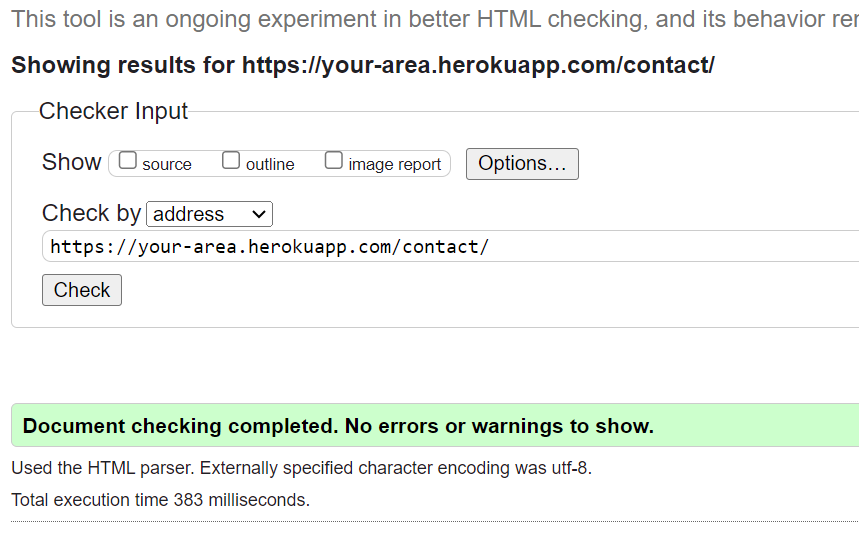
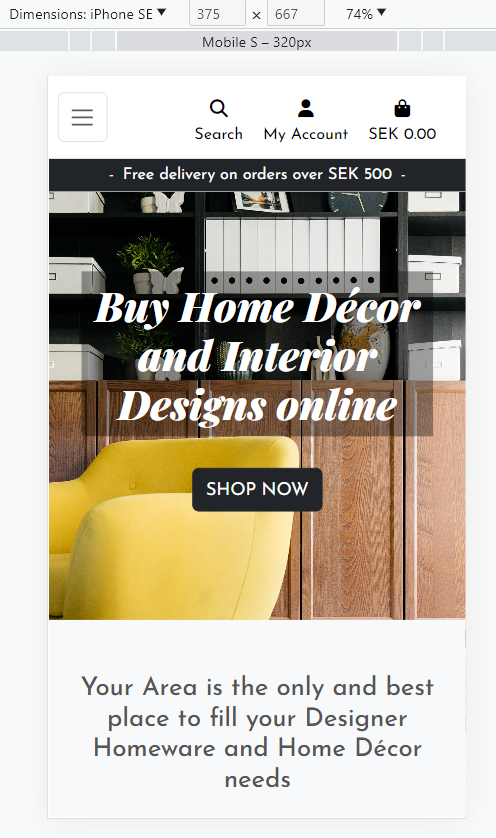
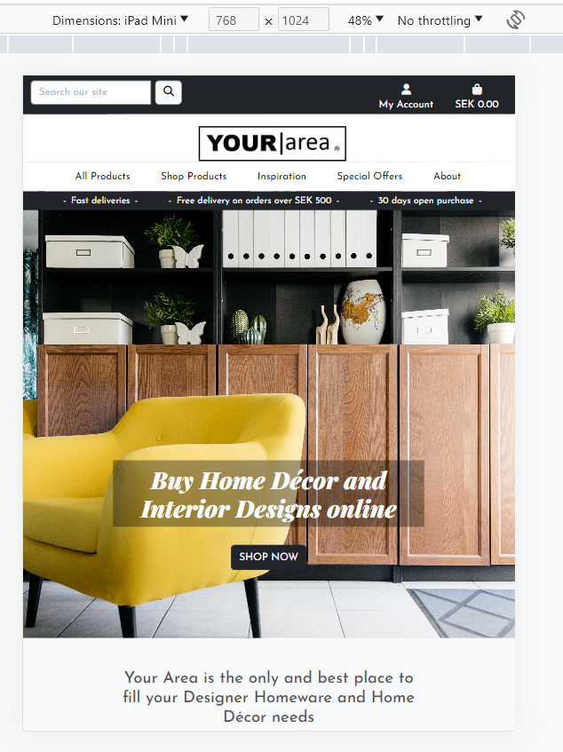
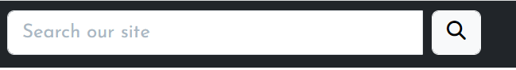
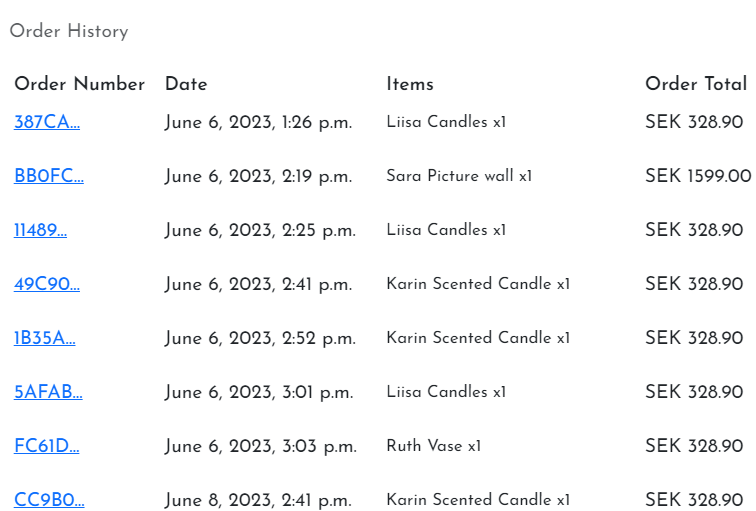
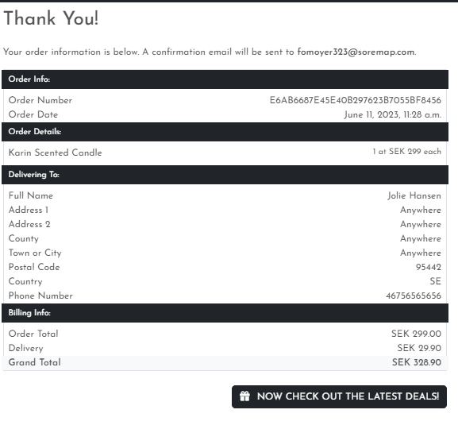
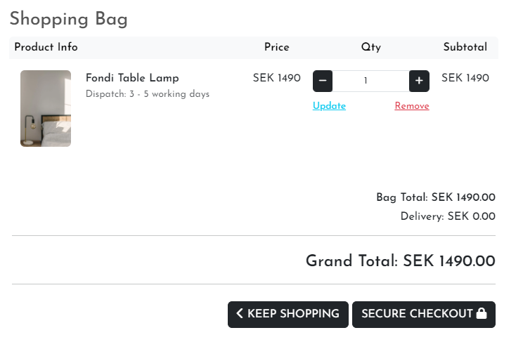
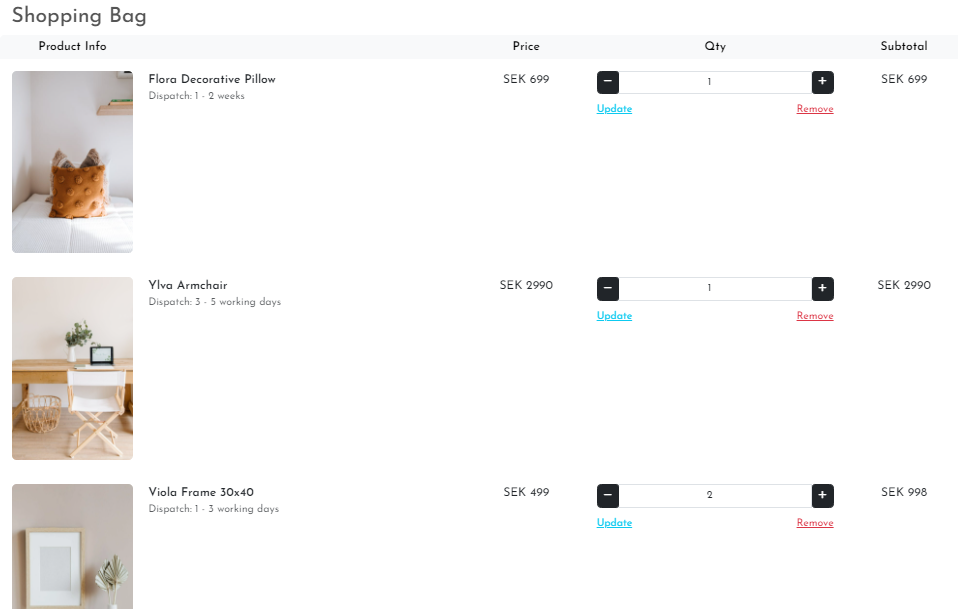

# Testing

## Code Validation

### HTML

I have used the recommended [HTML W3C Validator](https://validator.w3.org) to validate all of my HTML files.

| Page | W3C URL | Screenshot | Notes |
| --- | --- | --- | --- |
| Home | [W3C](https://validator.w3.org/nu/?doc=https%3A%2F%2Fyour-area.herokuapp.com%2F) |  | Pass: No error |
| Products | [W3C](https://validator.w3.org/nu/?doc=https%3A%2F%2Fyour-area.herokuapp.com%2Fproducts%2F) |  | Pass: No error |
| Gallery | [W3C](https://validator.w3.org/nu/?doc=https%3A%2F%2Fyour-area.herokuapp.com%2Fgallery%2F) |  | Pass: No Errors |
| About | [W3C](https://validator.w3.org/nu/?doc=https%3A%2F%2Fyour-area.herokuapp.com%2Fabout%2F) |  | Pass: No Errors |
| Contact | [W3C](https://validator.w3.org/nu/?doc=https%3A%2F%2Fyour-area.herokuapp.com%2Fcontact%2F) |  | Pass: No Errors |
| Newsletter | [W3C](https://validator.w3.org/nu/?doc=https%3A%2F%2Fyour-area.herokuapp.com%2Fnewsletter%2F) |  | Pass: No Errors |
| FAQ | [W3C](https://validator.w3.org/nu/?doc=https%3A%2F%2Fyour-area.herokuapp.com%2Ffaqs%2F) |  | Pass: No Errors |
| Register | [W3C](https://validator.w3.org/nu/?doc=https%3A%2F%2Fyour-area.herokuapp.com%2Faccounts%2Fsignup%2F) |  | Pass: No Errors |
| Log in | [W3C](https://validator.w3.org/nu/?doc=https%3A%2F%2Fyour-area.herokuapp.com%2Faccounts%2Flogin%2F) |  | Pass: No Errors |
| Bag | [W3C](https://validator.w3.org/nu/?doc=https%3A%2F%2Fyour-area.herokuapp.com%2Fbag%2F) |  | Pass: No Errors |
| Product Management | W3C |  | 2 Errors due to the widget on the form |
| Profile | W3C |  | Pass: No Errors |
| Checkout Success | W3C |  | Pass: No Error |

### CSS

I have used the recommended [CSS Jigsaw Validator](https://jigsaw.w3.org/css-validator) to validate all of my CSS files.

| File | Jigsaw URL | Screenshot | Notes |
| --- | --- | --- | --- |
| style.css | [Jigsaw](https://jigsaw.w3.org/css-validator/validator?uri=https%3A%2F%2Fyour-area.herokuapp.com%2F&profile=css3svg&usermedium=all&warning=1&vextwarning=&lang=sv) |  | Pass: No Errors or warnings for custom CSS |

### JavaScript

I have used the recommended [JShint Validator](https://jshint.com) to validate all of my JS files.

| File | Screenshot | Notes |
| --- | --- | --- |
| stripe_elements.js |  | Pass: No Errors |
| countryfield.js |  | Pass: No Errors |

### Python Validation - Pycodestyle

Python testing was done using Pycodestyle to ensure there were no syntax errors.

The only errors displayed (as per below screenshot) can be ignored. The majority are within automatically generated files with the exception of env.py and webhooks.py.

I have ignored the the formatting errors related to migration files with lines to long. 

| File | CI URL | Screenshot | Notes |
| --- | --- | --- | --- |
| All *py files | PEP8 |  | Pass: No errors |  

## Browser Compatibility

I've tested my deployed project on multiple browsers to check for compatibility issues.

| Browser | Screenshot | Notes |
| --- | --- | --- |
| Chrome |  | Works as expected |
| Firefox |  | Works as expected |
| Edge |  | Works as expected |

## Responsiveness

I've tested my deployed project on multiple devices to check for responsiveness issues.

| Device | Screenshot | Notes |
| --- | --- | --- |
| Mobile (DevTools) |  | Works as expected |
| Tablet (DevTools) |  | Works as expected |
| Desktop |  | Works as expected |
| Huawei P30 (Manual test) |  | Scrolls a bit to the sides |

## Lighthouse Audit

I've tested my deployed project using the Lighthouse Audit tool to check for any major issues.

| Page | Size | Screenshot | Notes |
| --- | --- | --- | --- |
| Home | Mobile |  | Slow Performance |
| Home | Desktop |  |  |
| Products | Mobile |  | Bad Performance |
| Products | Desktop |  | Slow Performance |
| Gallery | Mobile |  | Slow Performance |
| Gallery | Desktop |  | Slow Performance |
| About | Mobile |  | Slow Performance |
| About | Desktop |  |  |
| Contact | Mobile |  | Slow Performance |
| Contact | Desktop |  |  |
| Newsletter | Mobile |  | Slow Performance |
| Newsletter | Desktop |  |  |
| FAQ | Mobile |  | Slow Performance |
| FAQ | Desktop |  |  |
| Bag | Mobile |  | Slow Performance |
| Bag | Desktop |  |  |
| Checkout | Mobile |  | Slow Performance |
| Checkout | Desktop |  | |

## Defensive Programming

Defensive programming was manually tested with the below user acceptance testing:

| Page | User Action | Expected Result | Pass/Fail | Comments |
| --- | --- | --- | --- | --- |
| Home Page | | | | |
| | Click on Logo | Redirection to Home page | Pass | |
| | Searchbar in navigation | Performs search | Pass | |
| | Try to perform a blank search | Throws error message | Pass | |
| | Click on bag icon | Redirection to shopping bag | Pass | |
| | Click on shop now button | Redirection to products page | Pass | |
| | Click on View Inspiration Gallery | Redirection to Gallery page | Pass | |
| | Click on Contact in dropdown 'about' menu | Redirection to Contact page | Pass | |
| | Click on About in dropdown 'about' menu | Redirection to About page | Pass | |
| | Click on FAQ in dropdown 'about' menu | Redirection to FAQ page | Pass | |
| | Click on Newsletter in dropdown 'about' menu | Redirection to Newsletter page | Pass | |
| | Click on Product Management in 'user' menu | Redirection to add products page | Pass | |
| | Try to access Product Management via URL as a guest| Redirects to sign in page | Pass | |
| | Click on Profile in 'user' menu | Redirection to profile page | Pass | |
| | Try to access Profile via URL as a guest| Redirects to sign in page | Pass | |
| | Click on Register in 'user' menu | Redirection to sign in page | Pass | |
| | Click on Login in 'user' menu | Redirection to login page | Pass | |
| | Click on Logout in 'user' menu | Redirection to sign out page | Pass | |
| Products Page | | | | |
| | Click on Product image | Redirection to Products details page | Pass | |
| | Click on Edit link | Redirection to Edit Product page | Pass | |
| | Click on Delete link | Deletes products | Pass | |
| Product Details Page | | | | |
| | Click on Add to bag button | Add product to bag | Pass | |
| | Try to enter -1 or +99 with buttons | -/+ button disabled | Pass | |
| | Try to manually type and add -1 or +99 | Throws error message | Pass | |
| | Click on Keep shopping button | Redirects to product page | Pass | |
| | Click on Edit link | Redirection to Edit Product page | Pass | |
| | Click on Delete link | Deletes products | Pass | |
| | Try to Edit product via URL as a guest| Shows 404 page | Pass | |
| | Try to Delete product via URL as a guest| Shows 404 page  | Pass | |
| Contact Page | | | | |
| | Try to submit form with all fields blank | Throws error message | Pass | |
| | Try to submit form with invalid email format | Throws error message | Pass | |
| | Try to submit form with various blank fields | Throws error message | Pass | |
| Newsletter Page | | | | |
| | Try to submit form with blank field | Throws error message | Pass | |
| | Try to submit form with invalid email format | Throws error message | Pass | |
| Checkout Page | | | | |
| | Try to submit form with all fields blank | Throws error message | Pass | |
| | Try to submit form with invalid email format | Throws error message | Pass | |
| | Try to submit form with various blank fields | Throws error message | Pass | |
| | Try to access checkout page with empty bag | Throws error and redirects to products page | Pass | |
| Invalid URL | | | | |
| | Try to access invalid URL page | Redirects to 404 page | Pass | |
| Sign in page | | | | |
| | Try to submit form with invalid username | Throws error message | Pass | |
| | Try to submit form with blank fields | Throws error message | Pass | |
| | Try to access login page when already logged in | Redirects to home page | Pass | |
| | Click on home button | Redirects to home page | Pass | |
| | Click on Sign in button | Redirects to home page and shows success message | Pass | |
| Sign out page | | | | |
| | Try to access logout page when already logged out | Redirects to home page | Pass | |
| Sign up page | | | | |
| | Try to submit form with invalid username | Throws error message | Pass | |
| | Try to submit form with blank fields | Throws error message | Pass | |
| | Try to submit form with invalid email field | Throws error message | Pass | |
| | Click on sign in link | Redirects to login page | Pass | |
| Product Management page | | | | |
| | Try to submit form marked with * blank | Throws error message | Pass | |
| | Try to submit form with excessive amount | Throws error message | Fail | |
| Profile page | | | | |
| | Try to submit form with all fields blank | Updates form to blank | Pass | |
| | Try to submit form with letters on phone number field | Throws error message | Fail | |
| | Click on update information button | Updates information and shows success message | Pass | |

## User Story Testing

| User Story | Screenshot |
| --- | --- |
| As a store owner I can add/edit/delete products through an easy-to-use interface so that I can manage the store's contents. |  |
| As a Site user I can sign up for the website's newsletter so that I can keep up to date with new products and promotions. |  |
| - As a Site user I can immediately understand the purpose of the site so that I can decide if it meets my needs.|  |
| As a Site user I can sort all products so that I can view products based on price or title. |  |
| As a Site user I can search all products so that I can find what I am looking for. |  |
| As a Site user I can click on a product so that I can read the full product details. |  |
| As a Site user I can view a list of products so that I can select a product to view. |  |
| As a Site user I can intuitively navigate around the site so that find content. |  |
| As a Site user I can recover my password in case I forget it so that I can regain access to my account. |  |
| As a Site user I can save my personal details in my user profile so that I do not have to fill them out for future orders. |  |
| As a Site user I can view my order history so that I can remember what purchases I've made |  |
| As a Site user I can see my login status so that I know if I'm logged in or out. |   |
| As a Site user I can register a account so that I can have a personal account. |  |
| As a Site User I can log in and out of my account so that I can keep my account secure. |   |
| As a Site user I can view and recieve a order confirmation after checkout so that I know my purchase was successful. |  |
| As a Site user I can checkout as a guest so that I don't have to sign up for an account. |  |
| As a Site user I can view a the contents of my shopping cart at any time so that I can see what is included and the total cost. |  |
| As a Site user I can easily enter my payment information securely so that I can purchase my chosen products quickly with no issues. |  |
| As a Site user I can adjust the quantity of individual products in my cart so that I can easily make changes before I purchase. |  |
| As a Site user I can see a summary of my shopping cart when I checkout so that I know what products are included and the total cost before I commit to purchasing. |  |
| As a Site user, I can view a running total of my shopping cart as I am shopping so that I can see how much it costs in total. |  |
| As a Site user I can add several products in different quantities to my shopping cart so that I can purchase them all together when I am ready.|  |
| As a Site user I can save my personal details in my user profile so that I don't have to fill them out for future orders. |  |
| As a Site user I can view my order history so that I can keep track of my orders. |  |
| As a Site user I can view a specific category of products so that I can browse the type of products I'm looking for. |  |

## Bugs

| Bug | Status | Comment |
| --- | --- | --- |
| Footer and about section stacked on top of main image in deployed version | Closed | Deployed again and issue resolved |

## Unfixed Bugs

There are no remaining bugs that I am aware of.
